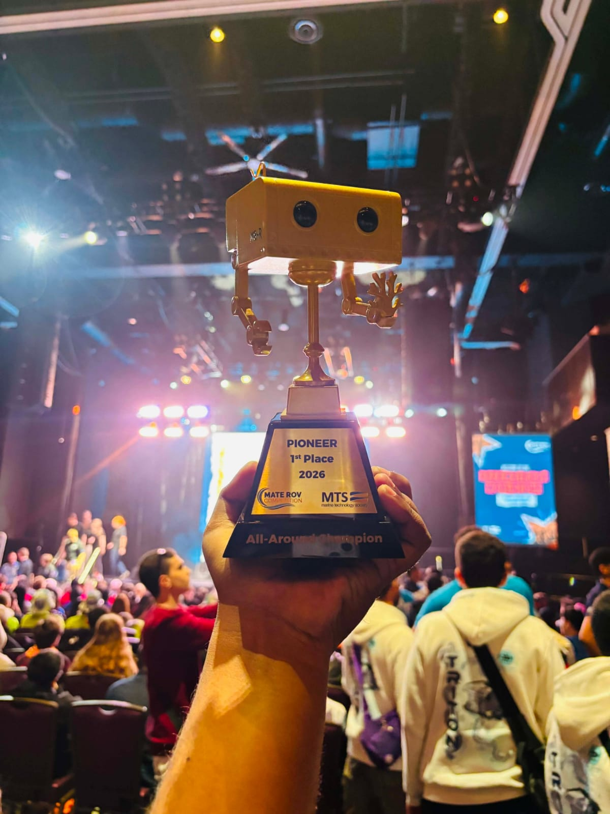
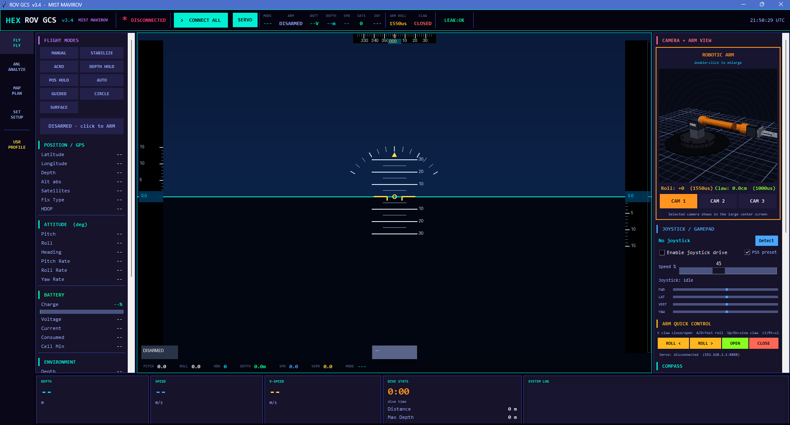
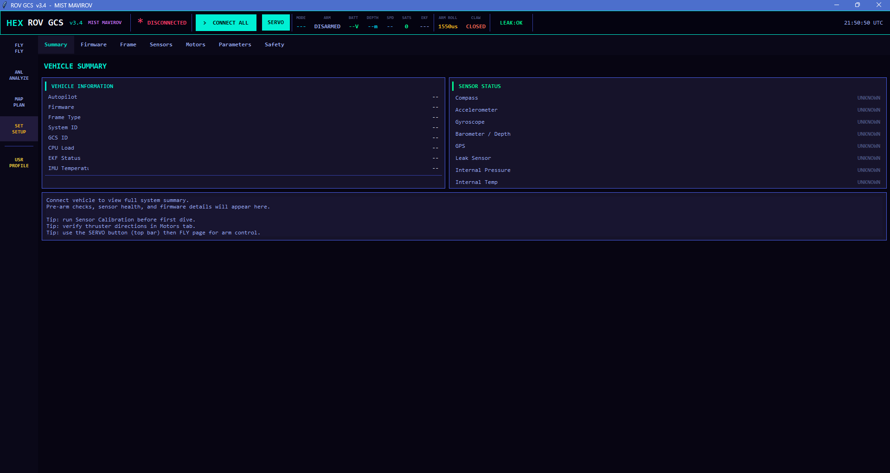

# MIST Mavirov Underwater ROV System

## MATE ROV World Champion 2026

**Project type:** Tethered underwater remotely operated vehicle and integrated pilot-control platform  
**Team:** MIST Mavirov  
**Recognition:** MATE ROV World Champion 2026  
**Primary contribution:** Software architecture, communication integration, ground-control application, telemetry, multi-camera streaming, mission tools, and manipulator control

---

## Project Overview

The MIST Mavirov underwater ROV is an integrated competition platform designed for reliable subsea observation, navigation, manipulation, and mission execution. The complete system combines a Pixhawk flight controller running the ArduSub control stack, a Raspberry Pi 5 communication hub, multiple underwater camera feeds, a Teensy-based manipulator controller, an Ethernet tether, and a custom Ground Control Station developed for surface operations.

The architecture separates time-critical vehicle control from high-level supervision. The Pixhawk handles attitude, depth, thruster coordination, and vehicle-state estimation. The Raspberry Pi manages communication services and video distribution. The Teensy provides deterministic control of the manipulator arm and claw. The pilot computer combines these subsystems in a unified operator interface.

The resulting platform provides one coordinated workflow for vehicle connection, telemetry monitoring, camera supervision, flight-mode selection, joystick driving, manipulator operation, mission planning, parameter management, system analysis, and safety response.

---

## Championship Recognition

The MIST Mavirov team achieved the title of **MATE ROV World Champion 2026** with the competition ROV and its supporting control ecosystem. The project demonstrates the team’s ability to integrate underwater mechanical design, embedded control, communication engineering, real-time software, and pilot-centered operation into a functional competition system.

### Championship Gallery

---

## Main System Objectives

The system was developed to meet the following operational objectives:

- Provide stable and low-latency control over a tethered underwater vehicle.
- Deliver live vehicle telemetry to the surface pilot station.
- Carry several simultaneous camera streams through the same Ethernet tether.
- Support manual, stabilized, depth-assisted, and mission-oriented operation.
- Provide precise control of the robotic arm and claw.
- Allow the pilot to monitor sensor health, battery status, depth, attitude, speed, and communication state.
- Keep safety functions visible and quickly accessible during operation.
- Maintain a modular architecture so that cameras, sensors, controllers, and vehicle settings can be updated independently.

---

## System Structure

The platform is organized into five major layers.

### 1. Surface Pilot Station

The surface station is the operator’s main control point. It includes the pilot computer, the custom MIST Mavirov ROV Ground Control Station, gamepad or keyboard input, and access to the vehicle’s communication network.

The pilot station is responsible for:

- Connecting to the onboard Raspberry Pi services.
- Receiving MAVLink telemetry from the flight controller.
- Displaying live camera feeds.
- Sending flight-mode, arm, disarm, mission, and configuration commands.
- Sending manipulator arm and claw commands to the Teensy controller.
- Presenting system status, warnings, sensor values, and operational logs.

### 2. Ethernet Tether

A single Ethernet tether carries the major communication channels between the surface and the ROV. This shared network transports telemetry, control commands, video streams, service-management traffic, and manipulator commands.

Using one tethered network simplifies system integration and allows each subsystem to use the protocol best suited to its task.

### 3. Raspberry Pi 5 Communication Hub

The Raspberry Pi acts as the onboard communications and media hub. It connects the flight controller and cameras to the surface network while allowing remote service control from the pilot station.

Its main responsibilities include:

- Forwarding Pixhawk MAVLink data to the surface computer.
- Running the multi-camera streaming services.
- Providing remote service access for startup and recovery.
- Maintaining separate data paths for vehicle telemetry and camera streams.
- Acting as the bridge between onboard hardware and surface applications.

### 4. Pixhawk and ArduSub Control Layer

The Pixhawk is the primary vehicle-control unit. It receives pilot commands and uses onboard sensors to manage thruster output, attitude, depth, and vehicle state.

Its responsibilities include:

- Reading the inertial and depth-related sensors.
- Estimating vehicle attitude and motion.
- Coordinating the thrusters according to the selected frame configuration.
- Supporting manual and assisted flight modes.
- Reporting telemetry, parameters, warnings, and mission status through MAVLink.
- Executing safety actions when configured failsafe conditions are triggered.

### 5. Teensy Manipulator Controller

The Teensy controller is dedicated to the robotic arm and claw. This separation keeps manipulator timing independent of the flight-controller workload.

Its responsibilities include:

- Receiving arm and claw commands from the surface GCS.
- Converting the requested position into calibrated servo output.
- Enforcing safe mechanical limits.
- Applying gradual motion to reduce sudden mechanical loading.
- Maintaining predictable manipulator response during vehicle operation.

---

## Architecture Summary

| Layer | Main Components | Primary Responsibility |
|---|---|---|
| Surface control | Pilot computer, custom GCS, PS5 controller, keyboard | Vehicle operation, supervision, planning, configuration, and safety response |
| Tether network | Ethernet tether and onboard network connection | Bidirectional transport for telemetry, video, control, and service management |
| Communication hub | Raspberry Pi 5 | MAVLink forwarding, camera streaming, and remote service coordination |
| Vehicle control | Pixhawk with ArduSub | Thruster control, stabilization, depth control, sensor fusion, and telemetry |
| Manipulator control | Teensy microcontroller, arm servo, claw servo | Deterministic arm and claw control with calibrated limits |
| Vision | Multiple USB cameras | Forward, side, and manipulator-area visual feedback |

---

## Communication Protocols

The ROV uses several communication protocols because telemetry, video, service management, and servo commands have different performance requirements.

### MAVLink Telemetry and Vehicle Commands

MAVLink is used for communication between the Pixhawk/ArduSub controller and the surface applications. The Pixhawk sends vehicle state information to the Raspberry Pi through its onboard connection. The Raspberry Pi forwards this data across the tether to the surface computer.

The MAVLink channel carries information such as:

- Vehicle heartbeat and connection status.
- Current flight mode and armed state.
- Pitch, roll, heading, and angular rates.
- Depth, vertical speed, and movement information.
- Battery voltage and current.
- GPS information when available.
- Sensor and estimator status.
- Flight-controller warnings and acknowledgements.
- Parameter values and mission items.

The same channel allows the Ground Control Station to send commands for mode changes, arming, disarming, calibration, motor testing, parameter updates, and mission transfer.

### RTSP Video Streaming

Each onboard camera is distributed as an independent RTSP stream. The Raspberry Pi captures the camera input, prepares it for network transport, and makes it available to the pilot station.

This approach provides:

- Separate selectable camera feeds.
- Efficient H.264 video transport.
- Compatibility with the custom GCS and standard video clients.
- Independent recovery if one stream becomes unavailable.
- Flexibility to assign cameras to navigation, situational awareness, and manipulator viewing.

### UDP Manipulator Control

The manipulator arm uses a lightweight UDP command path between the surface GCS and the Teensy controller. This channel is separate from the Pixhawk control path so that arm motion remains independent of vehicle flight commands.

The protocol identifies the required manipulator channel and the requested calibrated servo position. The GCS enforces configured limits before sending commands, and the Teensy applies the corresponding movement within the mechanical range.

The communication design provides:

- Low command overhead.
- Fast response for arm and claw control.
- Independent connection status in the GCS.
- Clear separation between vehicle propulsion and manipulator operation.
- Compatibility with keyboard and gamepad input.

### SSH Service Management

Secure remote sessions are used by the Ground Control Station to start and supervise the Raspberry Pi communication services. The GCS can wait for the Raspberry Pi to become reachable, establish service sessions, and report startup or connection errors to the pilot.

This allows the pilot to manage the onboard MAVLink forwarding and camera services from the surface without manually operating the Raspberry Pi during deployment.

### Human Input Layer

The pilot can operate the system through a PS5 DualSense controller or keyboard controls. The joystick layer maps pilot movement into forward, lateral, vertical, and yaw commands. Configurable speed scaling, dead-zone handling, button mapping, and emergency-stop behavior help make control predictable during competition operations.

---

## Operational Data Paths

| Source | Destination | Information Carried | Purpose |
|---|---|---|---|
| Pixhawk | Raspberry Pi | MAVLink telemetry and command responses | Vehicle-state reporting and autopilot communication |
| Raspberry Pi | Surface GCS and QGroundControl | Forwarded MAVLink data | Pilot monitoring, control, parameter access, and mission tools |
| USB cameras | Raspberry Pi | Raw video | Onboard visual acquisition |
| Raspberry Pi | Surface GCS | RTSP/H.264 streams | Live navigation and manipulator views |
| PS5 controller or keyboard | Surface GCS | Pilot input | Manual movement and manipulator operation |
| Surface GCS | Pixhawk | MAVLink commands | Flight modes, arm/disarm, missions, calibration, and configuration |
| Surface GCS | Teensy | UDP manipulator commands | Arm rotation and claw opening control |
| Teensy | Manipulator servos | Calibrated servo output | Physical movement of the robotic arm and claw |

---

# MIST Mavirov ROV Ground Control Station

## Application Overview

The custom Ground Control Station is a desktop application developed to combine the ROV’s main operational tools into a single interface. It reduces the need to switch between separate telemetry, camera, manipulator, mission, and configuration applications during a mission.

The current application identifies itself as **ROV GCS v3.4 — MIST Mavirov** and is organized around four principal workspaces: **Fly, Analyze, Plan, and Setup**.

### GCS Interface Images

---

## Fly Workspace

The Fly workspace is the main operational screen used during active vehicle control.

It provides:

- Vehicle connection and disconnection controls.
- A separate manipulator-link control.
- Flight-mode selection for supported ArduSub modes.
- Arm and disarm commands.
- Live attitude, position, depth, speed, and battery information.
- A heads-up display for orientation and motion awareness.
- Selectable live camera feeds.
- A robotic-arm visualization showing arm rotation and claw state.
- PS5 or generic gamepad control.
- Keyboard-based manipulator adjustment.
- Dive-time, maximum-depth, distance, and waypoint summaries.
- A timestamped system log for connection messages, warnings, and command responses.

The top status area keeps the most important values continuously visible, including connection state, mode, armed state, battery, depth, speed, estimator condition, manipulator position, leak state, and time.

---

## Analyze Workspace

The Analyze workspace presents recent telemetry as live sensor plots. It is intended for system checking, performance observation, and fault investigation.

The analysis panels include:

- Gyroscope measurements.
- Accelerometer measurements.
- Magnetometer measurements.
- Depth history.
- Battery history.
- Temperature and environmental measurements.

The application keeps a rolling set of recent samples so the pilot can observe changes and detect abnormal behavior without leaving the GCS.

---

## Plan Workspace

The Plan workspace provides mission and waypoint management through MAVLink.

It supports:

- Downloading the current mission from the vehicle.
- Adding and reviewing waypoint entries.
- Uploading a mission to the flight controller.
- Clearing the local and vehicle mission lists.
- Monitoring mission count and current waypoint progress.
- Displaying the vehicle’s current position and depth information.

The mission tools are integrated with the same connection and logging system used by the rest of the application.

---

## Setup Workspace

The Setup workspace centralizes vehicle configuration and pre-dive preparation. It is divided into several tabs.

### Summary

The Summary tab displays general vehicle information, sensor status, autopilot details, estimator condition, system load, and preparation guidance.

### Firmware

The Firmware tab identifies the installed flight-control software and provides a controlled workflow for selecting and loading a compatible local firmware file through a direct USB connection. The interface includes clear warnings because incorrect firmware can make the flight controller unusable or unsafe.

### Frame

The Frame tab allows the operator to review and select supported thruster layouts. The GCS presents the number and arrangement of thrusters so that the configured software frame can be checked against the physical ROV.

### Sensors

The Sensors tab supports calibration and health checking for the primary navigation sensors. It includes workflows for gyroscope, accelerometer, compass, and pressure-related calibration where supported by the flight controller.

### Motors

The Motors tab is used to verify individual motor direction and response. This allows the team to confirm the thruster mapping before entering the water.

### Parameters

The Parameters tab supports searching, viewing, editing, downloading, and writing vehicle parameters. It can display both predefined engineering groups and live flight-controller values.

### Safety

The Safety tab provides access to leak, internal-pressure, and temperature failsafe settings. It also includes a prominent emergency-stop control that returns manual commands to neutral and stops active motor tests.

---

## GCS Connection Strategy

The GCS treats the vehicle subsystems as related but independently recoverable connections.

- The main connection workflow starts the Raspberry Pi services, opens the MAVLink receiver, and connects the camera streams.
- Camera-service failure does not automatically prevent telemetry from operating.
- The manipulator uses a separate control button and UDP socket so it can be connected or disconnected independently.
- The GCS checks whether the pilot computer is using the expected vehicle subnet and warns the operator when the Teensy is likely to be unreachable.
- Timestamped logs provide visibility into startup, connection, acknowledgement, timeout, and error events.

This design helps the operator identify whether a problem belongs to telemetry, video, onboard service startup, or manipulator control.

---

## Manipulator Control and Visualization

The GCS maintains separate state values for the arm-rotation servo and claw servo. These values are bounded by configured mechanical limits before transmission.

Manipulator control is available through:

- Keyboard adjustment.
- On-screen controls.
- Gamepad input.
- A separate servo-link connection.

The interface also renders a three-dimensional representation of the manipulator. The visualization reflects the arm’s commanded rotation and estimated claw opening, helping the pilot understand the current manipulator state even when the physical arm is partly hidden from a camera.

---

## Safety and Reliability Features

The system includes several layers intended to reduce operational risk.

### Vehicle Safety

- Visible arm and disarm state.
- Flight-mode confirmation.
- Leak-state monitoring.
- Configurable pressure and temperature failsafes.
- Battery and estimator monitoring.
- Emergency neutral command and motor-test termination.
- Sensor calibration and motor-direction checks before deployment.

### Manipulator Safety

- Calibrated minimum and maximum servo positions.
- Separate limits for arm rotation and claw opening.
- Bounded commands even if an invalid configuration is loaded.
- Gradual servo movement to reduce sudden mechanical shock.
- Independent connection control for the manipulator link.

### Communication Reliability

- Heartbeat-based confirmation of the vehicle link.
- Separate telemetry, video, and manipulator channels.
- Service startup and recovery through the surface interface.
- Connection timeouts and status logs.
- Multiple camera streams so the operator is not dependent on one view.

---

## Typical Mission Workflow

1. Inspect the vehicle, tether, enclosure seals, thrusters, cameras, and manipulator.
2. Connect the pilot computer to the ROV Ethernet network.
3. Open the custom GCS and wait for the Raspberry Pi to become reachable.
4. Start the main vehicle connection so that telemetry and camera services are established.
5. Open the separate manipulator connection and verify that arm and claw commands produce the expected movement.
6. Review the Summary, Sensors, Motors, Parameters, and Safety tabs.
7. Confirm battery level, leak status, estimator state, camera availability, thruster direction, and control input.
8. Select the appropriate vehicle mode and arm only when the deployment area is clear.
9. Operate the ROV while monitoring depth, attitude, video, battery, telemetry, and system logs.
10. Use the emergency-stop control or disarm the vehicle if abnormal behavior occurs.
11. After recovery, disconnect the manipulator and main vehicle links and review the operational logs.

---

## Key Engineering Contributions

- Integrated MAVLink telemetry, camera streaming, and manipulator control on a shared tethered network.
- Developed a dedicated GCS that combines flight, analysis, mission, setup, and safety functions.
- Added simultaneous support for the custom GCS and QGroundControl through separate telemetry outputs.
- Implemented multi-camera supervision for navigation and manipulation tasks.
- Separated manipulator control from vehicle propulsion for clearer fault isolation.
- Added joystick, keyboard, and on-screen control methods.
- Added mechanical command limits and emergency controls.
- Designed a modular architecture that can be expanded with additional cameras, sensors, or vehicle functions.

---

## Technology Summary

| Area | Technologies and Components |
|---|---|
| Vehicle control | Pixhawk, ArduSub, MAVLink |
| Onboard computing | Raspberry Pi 5 |
| Manipulator control | Teensy microcontroller and calibrated servo control |
| Surface software | Custom Python desktop Ground Control Station |
| Video | USB cameras, H.264, RTSP |
| Networking | Ethernet tether, UDP, TCP-based media transport, SSH |
| Pilot input | PS5 DualSense controller, generic gamepad, keyboard |
| System tools | Mission planning, parameter management, calibration, sensor analysis, safety monitoring |

---

## Documentation

- [MIST Mavirov Technical Documentation 2026](https://github.com/Farhan-Mohib/portfolio-FMH/blob/main/MIST%20Mavirov_Technical%20Documentation_2026.pdf)
- [Portfolio Home](index.html)
- [Repository README](README.md)

---

## Final Note

The MIST Mavirov ROV is not only an underwater vehicle; it is a complete distributed control system. Its performance depends on coordinated operation across the flight controller, onboard computer, camera services, tether network, manipulator controller, and surface Ground Control Station. The MATE ROV World Champion 2026 achievement represents the combined engineering effort required to make these subsystems work together reliably in a demanding competition environment.
